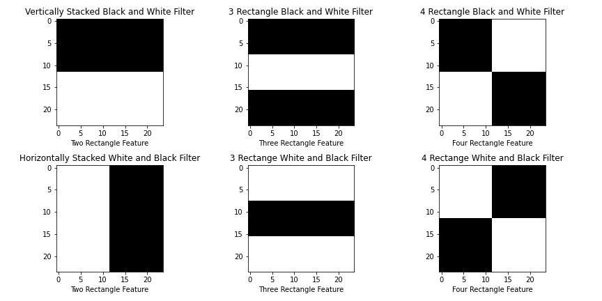

# Viola Jones Algorithm

### TL;DR
Replication of the algorithm and concepts discussed in the orignal paper authored by Viola and Jones.

# Haar Features
Haar features are kernels similar to convolutional kernels which are used for detecting specific features which correspond to an object. What is a feature? For any object, it has some fundamental features like edges, corners, curves, etc. Similarly a human face has features like eyebrows, nose, lips, etc. And these features can be determined by general low level features. Say if we take a black and white image of a human face then the eyebrow is going to be darker than the surrounding part of the face, hence we can construct a feature that can look at the image where there is a darker and a lighter section and can possibly mark it as an eyebrow. The image below represents the fundamental types of Haar Features,

The Viola Jones paper talks about three fundamental kinds of features, the **2 rectange features**, **3 rectange features** and the **4 rectange features**. In the next section we see the effect of these features.